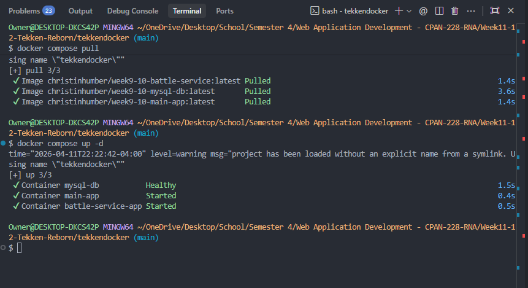
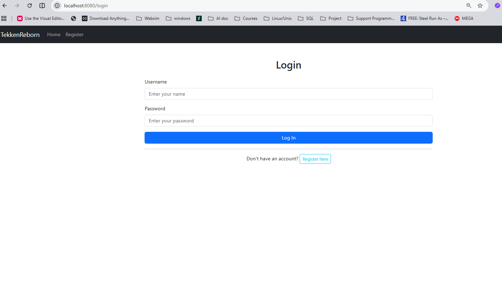
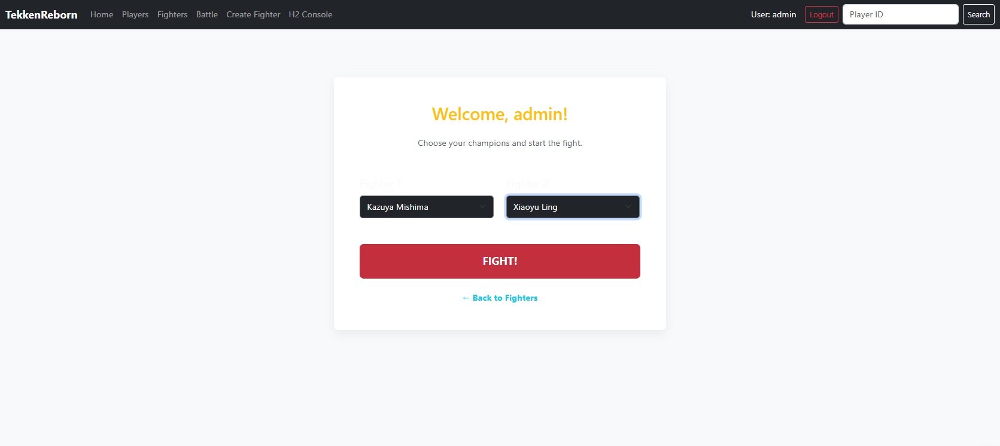
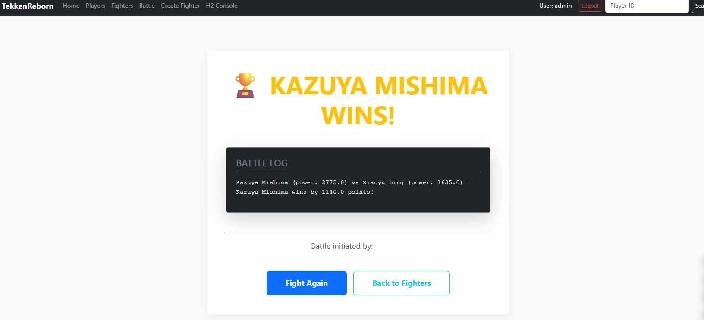
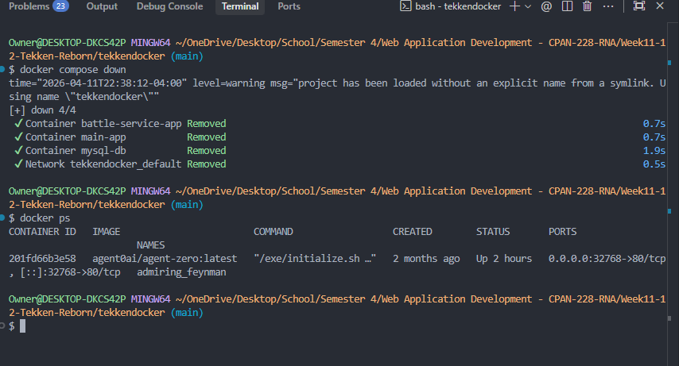

# Lab 07 - Docker Lab Submission

**Course:** CPAN 228 - Web Application Development
**Student:** Harry Joseph
**Professor:** Ly-Christin Mugisha
**Lab:** Optional Docker Lab - TekkenReborn

---

## Approach

Docker was already installed on my machine before starting this lab. The lab instructions provided a `docker-compose.yml` file with all three services pre-configured (database, main app, and battle service). I followed the steps outlined in the README, pulled the pre-built images from Docker Hub, and used Docker Compose to start and manage the containers.

---

## Screenshots

### Screenshot 1 - Pulling the Images and Starting the Containers

After writing the `docker-compose.yml` file, I ran `docker compose pull` to download all three images from Docker Hub. Once that finished, I ran `docker compose up -d` to start everything in the background. The terminal output shows all three containers came up successfully - `mysql-db` was marked Healthy, and both `main-app` and `battle-service-app` started without issues.



---

### Screenshot 2 - Application Running in the Browser

After waiting about 30 seconds for the database to fully initialize, I opened a browser and went to `http://localhost:8080`. The TekkenReborn login page loaded, which confirmed the main application container was up and accessible on port 8080.



---

### Screenshot 3 - Battle Page with Fighters Selected

I logged in using the admin account and navigated to the Battle page. I selected Kazuya Mishima and Xiaoyu Ling from the dropdowns. The fact that the fighter list loaded properly means the main app was successfully pulling data from the MySQL database container at this point.



---

### Screenshot 4 - Battle Result

After clicking the Fight button, the application returned a result page showing that Kazuya Mishima won the match (power: 2775.0 vs 1635.0, winning by 1140 points). This confirmed that the main app and the battle service were communicating correctly with each other and that all three containers were working together as expected.



---

### Screenshot 5 - Containers Stopped

Once I finished testing the application, I ran `docker compose down` to stop and remove the containers. I then ran `docker ps` to verify they were no longer running. The only entry in the output was an unrelated container that was already running on my machine before I started this lab.



---

## Commands Used

```bash
# Download the images from Docker Hub
docker compose pull

# Start all three containers in the background
docker compose up -d

# Verify all containers are running
docker ps

# Stop and remove the containers when done
docker compose down

# Confirm everything is stopped
docker ps
```

---

## Docker Compose Configuration

The `docker-compose.yml` file is located at [`TekkenDocker/docker-compose.yml`](TekkenDocker/docker-compose.yml). It references the following images:

| Service | Image | Port |
|---|---|---|
| Database | `christinhumber/week9-10-mysql-db:latest` | 3307:3306 |
| Main App | `christinhumber/week9-10-main-app:latest` | 8080:8080 |
| Battle Service | `christinhumber/week9-10-battle-service:latest` | 8081:8081 |
